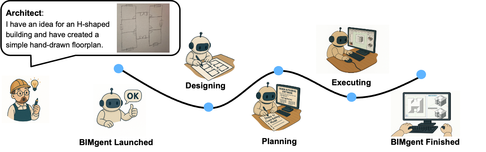
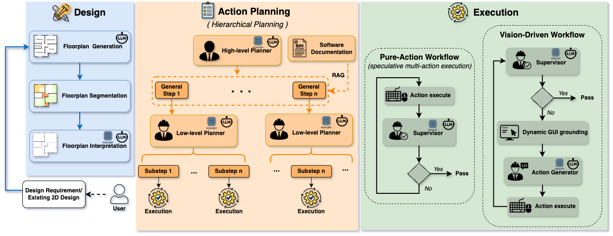
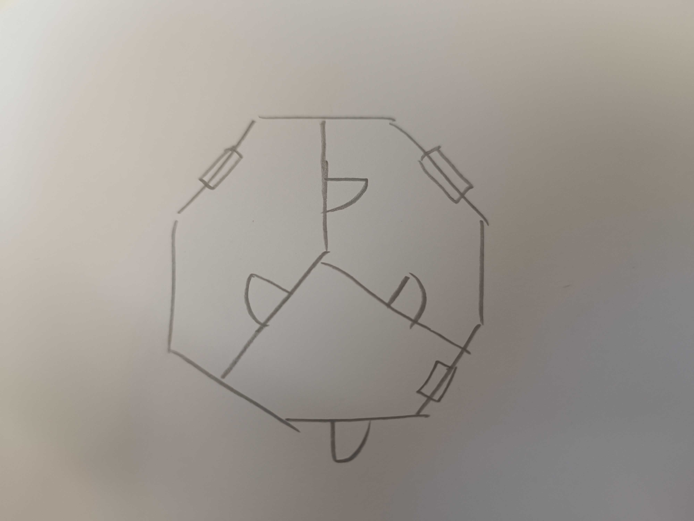

# BIMgent: Towards Autonomous Building Modeling via Computer-use Agents

🔗 **Website**: [https://tumcms.github.io/BIMgent.github.io/](https://tumcms.github.io/BIMgent.github.io/)  
📄 **Paper on arXiv**: [arXiv:2506.07217](https://arxiv.org/abs/2506.07217)



**BIMgent** is a novel agentic framework that enables architectural building modeling process to be performed autonomously through computer control.

Overview of the BIMgent framework.


## 🎥 Videos

**Generate a one-storey octagonal building based on  
the hand-drawn sketch.**



  
[▶️ Video](docs/BIMgent_videos/Full_videos/task6.mp4)

---

More detailed videos can be found on the website:  
🔗 [https://tumcms.github.io/BIMgent.github.io/](https://tumcms.github.io/BIMgent.github.io/)


## 🔧 Setup

### Software
The current version is based on and developed for the BIM authoring tool Vectorworks. When adapting the repository, please ensure you have Vectorworks installed on your PC. A valid license is required for the software applications.

### Prepare API Keys

This project uses APIs from OpenAI and Google (Gemini).  
You will need to update the `.env` file with your own API keys:
```
env OA_OPENAI_KEY="your_openai_api_key" # OpenAI API key 
Gemini_KEY="your_gemini_api_key" # Google Gemini API key 
```


### Dependencies
Please set up your Python (3.10) environment and install the required dependencies using the following command:
```bash
pip install -r requirements.txt
```

## 🚀 Get Started

Please update the configuration file at `conf/env_config_vectorworks.json` before running the agent:


### 1. Download Required Models

This framework relies on models developed in other repositories.  
Please download them and set the corresponding model paths in the configuration file.

#### 🔽 Download Instructions

##### 📦 DeepFloorplan Model
- **Repository**: [DeepFloorplan](https://github.com/zlzeng/DeepFloorplan)  
- **Instructions**: Follow the model download guide provided in the repository

##### 📦 OmniParser Model
- **Repository**: [OmniParser](https://github.com/microsoft/OmniParser)  
- **Instructions**: Follow the model download guide provided in the repository


### 2. Update `panel_coordinates` to match your tool panel, design panel and object info panel layout.  
   The format is `[x1, y1, x2, y2]` where:
   - `x1, y1` = top-left corner  
   - `x2, y2` = bottom-right corner

   Panel Definitions:
      - **Tool Panel**: Located on the left side, containing the list of interactable tools.
      - **Design Panel**: The central area where users interact to model the building.
      - **Object Info Panel**: Positioned on the right side, displaying information about selected components.

   The detailed coordinates can be obtained by running the following script:

   ```bash
   python mouse_detector.py
   ```
## Run

Use the following command to run the agent:

```bash
python agent_runner.py
```

To view the logic please check the script:
```
runner/vectorworks_runner.py
```

## Citation

If you use this work, please cite:

```bibtex
@misc{deng2025bimgentautonomousbuildingmodeling,
  title        = {BIMgent: Towards Autonomous Building Modeling via Computer-use Agents}, 
  author       = {Zihan Deng and Changyu Du and Stavros Nousias and André Borrmann},
  year         = {2025},
  eprint       = {2506.07217},
  archivePrefix = {arXiv},
  primaryClass = {cs.AI},
  url          = {https://arxiv.org/abs/2506.07217}
}
```