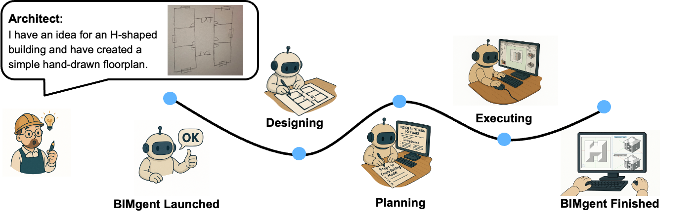
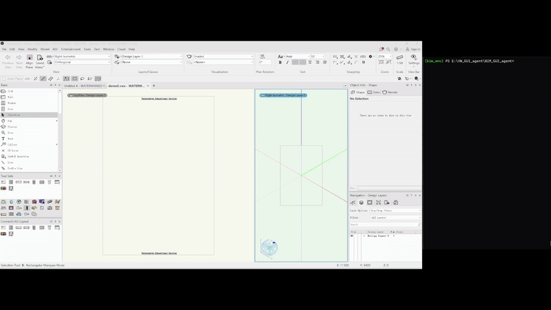

# BIMgent: Towards Autonomous Building Modeling via Computer-use Agents

🔗 **Website**: [https://tumcms.github.io/BIMgent.github.io/](https://tumcms.github.io/BIMgent.github.io/)
📄 **Paper on arXiv**: [arXiv:2506.07217](https://arxiv.org/abs/2506.07217)



**BIMgent** is an agentic framework that lets Large Language Models autonomously perform architectural building modeling in a real BIM authoring tool. Instead of generating BIM files through custom APIs, BIMgent drives the *actual* GUI of [Vectorworks](https://www.vectorworks.net/) — it looks at the screen, plans like a human modeler, and acts through the mouse and keyboard. Given a floorplan image and the number of floors, the agent produces a complete 3D BIM model end-to-end.


## 🎥 Demo

**Generate a one-storey octagonal building from a hand-drawn sketch.**



More demo videos are available on the project website:
🔗 [https://tumcms.github.io/BIMgent.github.io/](https://tumcms.github.io/BIMgent.github.io/)

## 🧠 Framework Overview

BIMgent implements the three-stage pipeline described in the paper:

1. **Floorplan Understanding** — the input floorplan image is resized and segmented by **DeepFloorplan** to extract wall and opening candidates. A **Design Interpreter** (Gemini) then refines wall geometry and classifies openings into doors and windows, producing structured floorplan metadata.

2. **Hierarchical Planning (Project Manager)** — an LLM-based planner decomposes the modeling task into:
   - a **high-level plan** (ordered list of modeling steps such as *create layers → build walls → insert doors → insert windows → add slabs → add roof*), and
   - a **low-level plan** per step, grounded in **retrieval-augmented builder documentation** (`res/vectorworks/builders/*.md`) so the agent follows the correct tool-specific workflow.

3. **Builders with Closed-Loop GUI Control** — each sub-step is executed by one of two builder agents:
   - **Vision-Driven Agent** — for tasks that require on-screen reasoning. It takes a screenshot, uses **OmniParser** for dynamic UI grounding, generates mouse/keyboard actions, executes them, and lets a **supervisor** LLM verify the outcome with a retry loop.
   - **Pure-Action Agent** — for tasks where coordinates and keystrokes are precomputed from the floorplan metadata (e.g. drawing walls along known endpoints).

All interactions with Vectorworks happen through the `UIController` / `MouseController` (PyAutoGUI-based) and a `ScreenshotsProcessor` that captures and crops the design panel, tool panel, and object-info panel.

## 🗂️ Repository Structure

```
BIMgent/
├── agent_runner.py                 # Entry point — prompts for floorplan + floors, then runs the pipeline
├── conf/
│   ├── config.py                   # Global Config (singleton)
│   └── env_config_vectorworks.json # Environment config: paths, panel coordinates, model paths
├── BIMgent/                        # Core package
│   ├── runner/
│   │   └── vectorworks_runner.py   # Main pipeline orchestration
│   ├── provider/
│   │   ├── ui_controller.py        # Mouse / keyboard control
│   │   ├── screenshots_processor.py# Screenshot capture + panel cropping
│   │   ├── Deep_fp_provider/       # DeepFloorplan wall/opening segmentation
│   │   ├── omni_provider/          # OmniParser UI element grounding
│   │   ├── builders_provider/      # RAG over builder documentation
│   │   └── loop_providers/
│   │       ├── design_interpreter.py     # Gemini-based floorplan interpreter
│   │       ├── project_manager.py        # High-level + low-level planners
│   │       ├── skill_generator_provider.py # Vision-driven + pure-action builders
│   │       ├── skill_executor.py         # Executes generated actions
│   │       └── llm_provider.py
│   ├── memory/                     # Working-area memory shared across stages
│   ├── floorplan/                  # Floorplan post-processing helpers
│   └── utils/                      # Coordinate transforms, resizing, JSON helpers
├── res/vectorworks/
│   ├── prompts/                    # Prompt templates for every LLM stage
│   └── builders/                   # Markdown docs retrieved via RAG (wall, door, window, slab, roof, stair, layer)
├── mini_building_benchmark/        # Mini benchmark + evaluation scripts used in the paper
└── docs/                           # Figures and demo media
```

## 🔧 Setup

### 1. Install Vectorworks
The current release targets the BIM authoring tool **Vectorworks 2025**. A valid license is required. Install it before running the agent and make sure the executable path in `conf/env_config_vectorworks.json` (`env_path`) is correct.

### 2. Python environment
Create a Python **3.10** environment and install dependencies:
```bash
pip install -r requirements.txt
```

### 3. API keys
BIMgent uses both OpenAI and Google Gemini models (planning, vision, design interpretation). Create a `.env` file at the repository root:
```env
OA_OPENAI_KEY="your_openai_api_key"
Gemini_KEY="your_gemini_api_key"
```

### 4. Download external models
BIMgent reuses two pretrained models. Download them and update the paths under `models_path` in `conf/env_config_vectorworks.json`.

| Model | Purpose | Repository |
| --- | --- | --- |
| **DeepFloorplan** | Wall / opening segmentation from the input floorplan image | [zlzeng/DeepFloorplan](https://github.com/zlzeng/DeepFloorplan) |
| **OmniParser** | Dynamic UI grounding of Vectorworks panels & dialogs (icon detector + Florence-2 captioner) | [microsoft/OmniParser](https://github.com/microsoft/OmniParser) |

Expected entries in the config:
```json
"models_path": {
  "deep_floorplan": "<path>/deep_floorplan/pretrained",
  "omini":          "<path>/omni/weights/icon_detect/model.pt",
  "Florence2":      "<path>/omni/weights/icon_caption_florence"
}
```

### 5. Calibrate panel coordinates
Vectorworks' panels must be mapped so the agent knows where to look and click. Update `panel_coordinates` in `conf/env_config_vectorworks.json` to match your screen layout:

```json
"panel_coordinates": {
  "tool_panel":   [x1, y1, x2, y2],   // Left-hand tool list
  "design_panel": [x1, y1, x2, y2],   // Central modeling canvas
  "object_info":  [x1, y1, x2, y2],   // Right-hand object info panel
  "whole_panel":  [0, 0, 1920, 1080]  // Full screen
}
```
Each rectangle is `[top-left x, top-left y, bottom-right x, bottom-right y]`. Coordinates can be read off interactively with:
```bash
python mouse_detector.py
```

## 🚀 Running the Agent

Launch Vectorworks with an empty document, arrange the panels to match your `panel_coordinates`, then run:

```bash
python agent_runner.py
```

You will be prompted for:
1. **The path to a floorplan image** (a real photo, a rendered floorplan, or a hand-drawn sketch).
2. **The number of floors** the building has.

Non-interactive usage:
```bash
python agent_runner.py \
  --envConfig ./conf/env_config_vectorworks.json \
  --floorplanPath /path/to/floorplan.png \
  --taskDescription "The building has 2 floors based on the provided layout."
```

During execution the agent will:
1. Run DeepFloorplan + the Design Interpreter to produce floorplan metadata.
2. Call the high-level planner, then the low-level planner (per step, with RAG guidance).
3. Take control of mouse and keyboard to model the building in Vectorworks, with screenshot-based supervision and retries.

**⚠️ Note:** Once the agent starts acting, keep your hands off the mouse and keyboard — the agent is driving the real desktop. Intermediate screenshots, planner outputs, and per-step logs are saved under the run's work directory (`memory.json`, `working_process_data.json`, and `screenshots/`).

The main orchestration logic lives in [`BIMgent/runner/vectorworks_runner.py`](BIMgent/runner/vectorworks_runner.py).

## 📊 Mini Building Benchmark

The `mini_building_benchmark/` folder contains the small-scale benchmark used in the paper for evaluating floorplan understanding and end-to-end modeling:
- `ori_images/` and `scaled_images/` — source and resized floorplans,
- `GT/` — ground-truth annotations,
- `eva_matric.py` — computes the evaluation metrics reported in the paper.

## 📚 Citation

If you use this work, please cite:

```bibtex
@misc{deng2025bimgentautonomousbuildingmodeling,
  title         = {BIMgent: Towards Autonomous Building Modeling via Computer-use Agents},
  author        = {Zihan Deng and Changyu Du and Stavros Nousias and André Borrmann},
  year          = {2025},
  eprint        = {2506.07217},
  archivePrefix = {arXiv},
  primaryClass  = {cs.AI},
  url           = {https://arxiv.org/abs/2506.07217}
}
```
